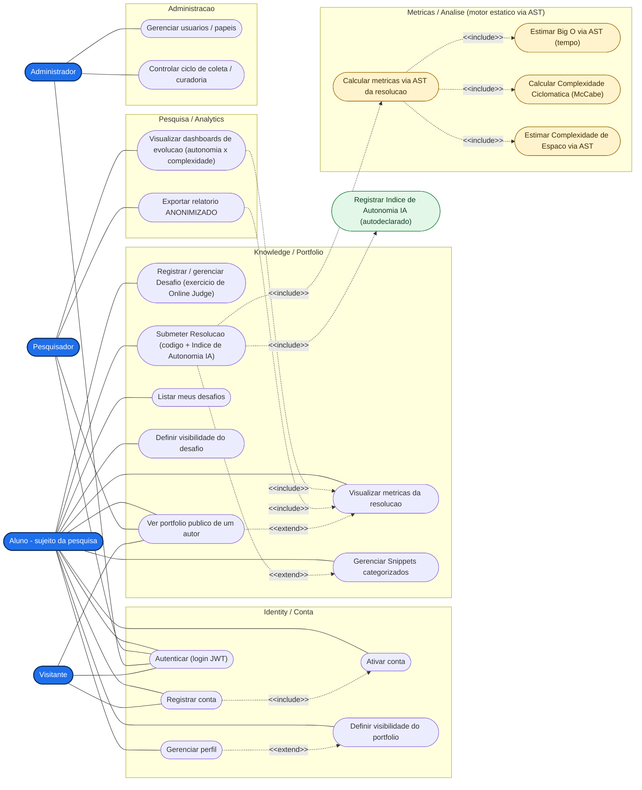

# CodeInsights V2 — Diagramas de Reestruturação

> Documento de **design** da reestruturação do backend (V2). Reúne, num só lugar, o **diagrama de
> classes** (modelo de domínio), o **diagrama de casos de uso** e o **diagrama de arquitetura**.
>
> **Base dos diagramas:**
> - **Produto / domínio:** estado atual do backend da **V1** (`code-archive`) — entidades, casos de uso
>   e endpoints realmente existentes.
> - **Arquitetura / padrão de implementação:** **IFConecta** (branch `main`) — Hexagonal/Clean
>   *layer-first*.
> - **Núcleo de pesquisa:** o que o [`CLAUDE.md`](../CLAUDE.md) e o
>   [`Modelo de Projeto - CodeInsights.pdf`](../Modelo%20de%20Projeto%20-%20CodeInsights.pdf) exigem —
>   métricas de aprendizado, atores de pesquisa e exportação anonimizada.
>
> Os diagramas usam **Mermaid** (renderiza nativamente no GitHub/GitLab/VS Code). Todos foram validados
> contra o parser do Mermaid 11.15.

---

## 1. Convenções e decisões de modelagem

Estas decisões valem para os três diagramas e explicam *por que* a V2 diverge da V1.

| # | Decisão | Racional |
|---|---------|----------|
| **D1** | **Domínio em português, pacotes/camadas/contextos em inglês.** Entidades: `Usuario`, `Desafio`, `Resolucao`, `Snippet`, `ResultadoMetrica`. Camadas: `domain`/`application`/`infrastructure`. Contextos: `identity`, `knowledge`. | `CLAUDE.md`: idioma de domínio majoritariamente português; padrão IFConecta para camadas/contextos. A V1 nomeava o domínio em inglês (`User`, `Challenge`, `Snippet`). |
| **D2** | **Empacotamento *layer-first*** (camada no topo, contexto no 2º nível). | Padrão IFConecta. A V1 era *context-first* (`identity/`, `knowledge/` no topo) **com uma camada `presentation/` separada** — eliminada na V2 (controllers vão para `infrastructure/web`). |
| **D3** | **Separar `Desafio` (enunciado) de `Resolucao` (submissão).** | **Achado central da V1:** o agregado `Challenge` **mistura** enunciado + código do aluno + métricas numa única tabela/linha (um `Challenge` é, ao mesmo tempo, o desafio e sua única resolução). Isso impede múltiplas submissões, vários alunos por desafio e histórico temporal — justamente o que a pesquisa precisa para medir *evolução*. |
| **D3·b** | **O próprio usuário cria o `Desafio`** (portfólio pessoal): registra um exercício que resolveu num **Online Judge externo** (NepsAcademy, LeetCode, Codeforces…), com `titulo`, `enunciado`/descrição, `plataformaOrigem`, `identificadorExterno` e `urlExterna`. `autorId` = dono. | Fluxo central do produto: o aluno "passa para o CodeInsights" o que resolveu na plataforma externa. Dois alunos que resolvem o mesmo problema geram **registros separados**; os campos de identificação externa deixam o agrupamento por `(plataforma + id)` viável **por adição** no futuro. |
| **D4** | **Métricas extensíveis via Strategy.** Porta de domínio `AnalisadorMetricaPort` + enum `TipoMetrica` + entidade `ResultadoMetrica` (datada, rastreável). Nova métrica = nova classe (Open/Closed). | Objetivo específico explícito da IC ("crescer por adição, não por modificação"). Na V1 as métricas eram `String`/`Integer` soltos, sem análise alguma. |
| **D5** | **Distinguir a *fonte* das métricas.** `Índice de Autonomia IA` (1–5) é **autodeclarado** pelo aluno; `Big O`, `Ciclomática (McCabe)` e `Espaço` são **estimados por análise estática via AST** (nunca execução; Big O exato é indecidível). Ambos coexistem sob a mesma porta; só os 3 estáticos usam `AnalisadorAstPort`. | Fundamentação teórica do projeto. |
| **D6** | **Papéis via enum `Role` (ALUNO, PESQUISADOR, ADMIN)**, e não herança `Usuario` abstract + subclasses. | Ao contrário de `Aluno/Professor/Institucional` do IFConecta (que têm atributos próprios — prontuário, SIAPE), os atores do CodeInsights **diferem apenas em autorização**. Se surgirem atributos divergentes, a evolução natural é migrar para `@Inheritance(JOINED)` — o enum permanece compatível. *(Ver [Decisões em aberto](#5-decisões-em-aberto--a-confirmar).)* |
| **D7** | **`Visibilidade` vira enum** (`PUBLICO`/`PRIVADO`), substituindo os `boolean isProfilePublic` (perfil) e `isPublic` (desafio) da V1. | Padronização. |
| **D8** | **Fronteira PII × dados analisáveis.** `identity` guarda dados identificáveis; `knowledge` guarda dados de métrica/solução. A exportação para pesquisa é **anonimizada** (pseudônimo estável). | Ética / Comitê do IFSP; análise empírica usa relatórios anonimizados. |
| **D9** | **Convenções V2 herdadas do IFConecta:** invariantes lançam `NegocioException`; entidades têm construtor de **criação** (gera UUID + defaults) e de **reconstituição**; referências entre agregados por **ID** (`autorId`, `desafioId`); paginação via `Pagina<>`; JWT com **jjwt** (`JWT_SECRET` sem default); `@CurrentUserId UUID`; Flyway dono do schema; `*Mapper` dedicado. | A V1 usava `IllegalArgument/IllegalStateException`, `auth0 java-jwt` (com default inseguro), `Authentication.getName()`, `List<>` sem paginação e mapeamento inline. |

---

## 2. Diagrama de Classes (modelo de domínio)

Mostra a **camada de domínio** da V2 (`domain/<contexto>/model` + `enums` + `port`), agrupada por bounded
context. Casos de uso, DTOs, controllers e entidades JPA ficam de fora (são detalhe de outras camadas).

```mermaid
classDiagram
    direction LR

    %% ============ BOUNDED CONTEXT: identity ============
    namespace identity {
        class Usuario {
            <<aggregate root>>
            -UUID id
            -String username
            -String email
            -String senhaHash
            -Role role
            -Visibilidade visibilidadePerfil
            -StatusConta status
            -OffsetDateTime criadoEm
            -OffsetDateTime atualizadoEm
            +ativarConta()
            +definirSenha(String novoHash)
            +tornarPerfilPublico()
            +tornarPerfilPrivado()
            +promoverParaPesquisador()
            +promoverParaAdmin()
            +ehAdmin() boolean
        }

        class Role {
            <<enumeration>>
            ALUNO
            PESQUISADOR
            ADMIN
        }

        class Visibilidade {
            <<enumeration>>
            PUBLICO
            PRIVADO
        }

        class StatusConta {
            <<enumeration>>
            PENDENTE_VERIFICACAO
            ATIVO
            INATIVO
            SUSPENSO
        }
    }

    Usuario --> Role : papel
    Usuario --> Visibilidade : perfil
    Usuario --> StatusConta : ciclo de vida

    %% ============ BOUNDED CONTEXT: knowledge ============
    namespace knowledge {
        class Desafio {
            <<aggregate root>>
            -UUID id
            -UUID autorId
            -String titulo
            -String enunciado
            -String plataformaOrigem
            -String identificadorExterno
            -String urlExterna
            -Visibilidade visibilidade
            -OffsetDateTime criadoEm
            -OffsetDateTime atualizadoEm
            +publicar()
            +ocultar()
            +atualizarEnunciado(String texto)
            +pertenceA(UUID usuarioId) boolean
        }

        class Resolucao {
            <<aggregate root>>
            -UUID id
            -UUID autorId
            -UUID desafioId
            -String codigoFonte
            -LinguagemProgramacao linguagem
            -int indiceAutonomiaIA
            -String descricaoApoioIA
            -Visibilidade visibilidade
            -boolean analisada
            -OffsetDateTime submetidaEm
            +registrarAutonomia(int valor)
            +marcarComoAnalisada()
            +publicar()
            +pertenceA(UUID usuarioId) boolean
        }

        class Snippet {
            <<aggregate root>>
            -UUID id
            -UUID autorId
            -String codigo
            -String descricao
            -CategoriaConceito categoria
            -OffsetDateTime criadoEm
            +atualizarConteudo(String codigo, String descricao)
            +recategorizar(CategoriaConceito nova)
        }

        class ResultadoMetrica {
            <<entity>>
            -UUID id
            -UUID resolucaoId
            -TipoMetrica tipo
            -String rotulo
            -int valorOrdinal
            -boolean aproximacao
            -String versaoAnalisador
            -OffsetDateTime calculadoEm
            +ehDeFonteAst() boolean
        }

        class LinguagemProgramacao {
            <<enumeration>>
            JAVA
            PYTHON
            CPP
            JAVASCRIPT
            C
        }

        class TipoMetrica {
            <<enumeration>>
            INDICE_AUTONOMIA_IA
            BIG_O_TEMPO
            COMPLEXIDADE_CICLOMATICA
            COMPLEXIDADE_ESPACO
            +fonteAst() boolean
        }

        class CategoriaConceito {
            <<enumeration>>
            ESTRUTURA_DADOS
            RECURSAO
            ORDENACAO
            GRAFOS
            PROGRAMACAO_DINAMICA
            STRINGS
            MATEMATICA
        }
    }

    %% --- relacoes do dominio knowledge ---
    Desafio --> Visibilidade : visibilidade
    Resolucao --> Visibilidade : visibilidade
    Resolucao --> LinguagemProgramacao : linguagem
    ResultadoMetrica --> TipoMetrica : tipo
    Snippet --> CategoriaConceito : categoria

    %% referencias entre agregados por ID (nao grafo de objetos)
    Resolucao ..> Desafio : desafioId ref-by-id
    Resolucao ..> Usuario : autorId ref-by-id
    Desafio ..> Usuario : autorId ref-by-id
    Snippet ..> Usuario : autorId ref-by-id

    %% Resolucao e analisada e produz N ResultadoMetrica (associacao por ID, nao composicao)
    Resolucao "1" --> "0..N" ResultadoMetrica : produz por analise
    ResultadoMetrica ..> Resolucao : resolucaoId ref-by-id

    %% invariante de dominio: indiceAutonomiaIA entre 1 e 5 (NegocioException fora do intervalo)

    %% ============ PORTA / STRATEGY DE METRICAS (extensao) ============
    class AnalisadorMetricaPort {
        <<interface>>
        +tipo() TipoMetrica
        +suporta(TipoMetrica t) boolean
        +analisar(ContextoAnalise ctx) ResultadoMetrica
    }

    class ContextoAnalise {
        <<value object>>
        -UUID resolucaoId
        -String codigoFonte
        -LinguagemProgramacao linguagem
        -int indiceAutonomiaIA
    }

    class AutonomiaIAAnalyzer {
        <<service>>
        +tipo() TipoMetrica
        +analisar(ContextoAnalise ctx) ResultadoMetrica
    }
    class BigOAstAnalyzer {
        <<service>>
        +tipo() TipoMetrica
        +analisar(ContextoAnalise ctx) ResultadoMetrica
    }
    class ComplexidadeCiclomaticaAnalyzer {
        <<service>>
        +tipo() TipoMetrica
        +analisar(ContextoAnalise ctx) ResultadoMetrica
    }
    class ComplexidadeEspacoAnalyzer {
        <<service>>
        +tipo() TipoMetrica
        +analisar(ContextoAnalise ctx) ResultadoMetrica
    }
    class NovaMetricaAnalyzer {
        <<service>>
        +tipo() TipoMetrica
        +analisar(ContextoAnalise ctx) ResultadoMetrica
    }

    class AnalisadorAstPort {
        <<interface>>
        +parsear(String codigo, LinguagemProgramacao lng) Ast
    }

    %% autodeclarada (fonte = autorrelato)
    AnalisadorMetricaPort <|.. AutonomiaIAAnalyzer
    %% fonte = AST estatica
    AnalisadorMetricaPort <|.. BigOAstAnalyzer
    AnalisadorMetricaPort <|.. ComplexidadeCiclomaticaAnalyzer
    AnalisadorMetricaPort <|.. ComplexidadeEspacoAnalyzer
    %% ponto de extensao: nova metrica = nova classe, sem modificar as demais
    AnalisadorMetricaPort <|.. NovaMetricaAnalyzer

    AnalisadorMetricaPort ..> ContextoAnalise : consome
    AnalisadorMetricaPort ..> ResultadoMetrica : produz
    AnalisadorMetricaPort ..> TipoMetrica : declara
    BigOAstAnalyzer ..> AnalisadorAstPort : usa AST
    ComplexidadeCiclomaticaAnalyzer ..> AnalisadorAstPort : usa AST
    ComplexidadeEspacoAnalyzer ..> AnalisadorAstPort : usa AST
```

**O que mudou em relação à V1 (e por quê):**

- **`Desafio` ⟂ `Resolucao`** — `codigoFonte`, `linguagem`, `indiceAutonomiaIA` e as complexidades **migram**
  de `Challenge` para `Resolucao`. O invariante "autonomia ∈ [1,5]" agora vive em
  `Resolucao.registrarAutonomia(int)` (lança `NegocioException`).
- **`Desafio` é criado pelo próprio usuário** e representa um exercício resolvido num **Online Judge
  externo** (NepsAcademy, LeetCode, …): além de `titulo`/`enunciado`, guarda `plataformaOrigem`,
  `identificadorExterno` e `urlExterna`. Cada usuário tem o seu registro (portfólio pessoal — `autorId` =
  dono); esses campos externos mantêm aberta a evolução para agrupar/comparar alunos no mesmo problema.
- **Núcleo de métricas é 100% novo:** `ResultadoMetrica` (entidade datada e imutável, com
  `versaoAnalisador` e flag `aproximacao` para rastreabilidade científica e séries temporais), enum
  `TipoMetrica`, a porta-Strategy `AnalisadorMetricaPort` com 4 implementações, e o **ponto de extensão
  explícito** `NovaMetricaAnalyzer`. O orquestrador injeta `List<AnalisadorMetricaPort>` (Spring), então
  uma nova métrica não toca nas existentes.
- **`AnalisadorAstPort`** separa o *parsing* (por linguagem) das *métricas* (Strategies). Só Big O,
  Ciclomática e Espaço o consomem; Autonomia IA é autodeclarada.
- **`Snippet`** deixa de ser composição interna de `Challenge` (a V1 usava `List<Snippet>` em grafo, com
  um *bug* que reusava o id do challenge como id do snippet) e passa a **referenciar o autor por ID**, com
  categoria em **enum `CategoriaConceito`** (era `String` livre).
- **`identity`:** ganha enum `Role` (a V1 **não tinha papel algum** — sem coluna, sem *claim* no JWT),
  enum `StatusConta` + `ativarConta()` (a V1 não tinha ativação/verificação de e-mail) e enum
  `Visibilidade`.

**A confirmar:** os *valores* dos enums `LinguagemProgramacao` e `CategoriaConceito` são exemplos
plausíveis do domínio de programação competitiva (a V1 usava `String` livre / nem tinha campo de
linguagem) — devem ser fechados junto à rubrica de pesquisa.

---

## 3. Diagrama de Casos de Uso

UML de casos de uso simulado em `flowchart` (o Mermaid não tem tipo nativo): **atores** à esquerda (azul),
**casos de uso** arredondados agrupados por módulo, **associações** em linha sólida e relações
`<<include>>`/`<<extend>>` pontilhadas. O motor de métricas estáticas (via AST) está em amarelo; o caso
**autodeclarado** (Autonomia IA) em verde, para deixar a *fonte* visualmente distinta.

**Leitura e adições em relação à V1:**

- **Atores `Pesquisador` e `Administrador` são novos** (a V1 não tinha RBAC). O Pesquisador acessa
  **dashboards de evolução** e **exportação anonimizada** — nunca PII. O Administrador mapeia
  `/api/admin/**` (`hasRole(ADMIN)`): gerencia usuários/papéis e **controla o ciclo de coleta** (porta de
  entrada do Comitê de Ética).
- **`Submeter Resolucao` → `<<include>>` `Calcular métricas via AST`**, que por sua vez inclui as 3
  métricas estáticas. O **Índice de Autonomia IA** é um `<<include>>` *separado* (fonte = autorrelato).
- **`Visitante`** só vê portfólio público (rota pública herdada da V1) e pode registrar/logar.
- A V1, na prática, só tinha: registrar, login, ver/editar visibilidade do perfil, submeter challenge,
  listar meus challenges, ver detalhe, listar públicos por autor. Todo o módulo **Pesquisa/Analytics**, o
  **motor de métricas** e a **ativação de conta** são da V2.

**Fluxo central do produto:** o **Aluno cria o próprio `Desafio`** — ele resolve um exercício num Online
Judge externo (NepsAcademy, LeetCode, …) e o "passa para o CodeInsights": título, descrição,
`plataformaOrigem` e o código. Por isso `Registrar / gerenciar Desafio` está ligado ao **Aluno**. O
**Administrador** não cadastra desafios; cuida de usuários/papéis e do **ciclo de coleta/curadoria**
(gate do Comitê de Ética).

---

## 4. Diagrama de Arquitetura

Visão *layer-first* (Hexagonal/Clean). Três camadas empilhadas — `infrastructure` (laranja) →
`application` (azul) → `domain` (verde, núcleo) — com a **regra da dependência** apontando sempre para
dentro. As portas vivem no domínio; os adaptadores na infraestrutura **implementam** essas portas (setas
`implements`), materializando a **inversão de dependência**. O **fluxo de requisição está numerado 1–9**.

```mermaid
flowchart TB

  %% ===== Sistemas externos / laterais =====
  Cliente["Cliente React + Vite SPA :5173 consome /api"]:::ext
  Swagger["Swagger UI / OpenAPI springdoc /swagger-ui.html"]:::ext
  Postgres[("PostgreSQL Flyway dono do schema Hibernate ddl-auto=validate open-in-view=false")]:::ext
  ASTEngine["Motor de analise AST (parser por linguagem) usado pelos adapters de parsing"]:::ext

  %% ============================================================
  %% INFRAESTRUTURA (camada externa)
  %% ============================================================
  subgraph INFRA["infrastructure (detalhes / adaptadores)"]
    direction TB

    subgraph WEB["web/&lt;contexto&gt;"]
      CtrlId["controller/identity AuthenticationController UsuarioController AdminUsuarioController /api/... + @CurrentUserId"]:::infra
      CtrlKn["controller/knowledge DesafioController ResolucaoController SnippetController RelatorioController /api/..."]:::infra
      WebDto["dto: *Request (@Valid) *Response (ex.: TokenResponse)"]:::infra
    end

    subgraph PERS["persistence/&lt;contexto&gt;"]
      SpringRepo["repository SpringData*Repository extends JpaRepository"]:::infra
      Adapter["adapter *RepositoryAdapter @Component implementa porta -> Pagina&lt;&gt;"]:::infra
      Mapper["mapper *Mapper toEntity/toDomain EntityManager.getReference"]:::infra
      JpaEnt["entity *JpaEntity (anotacoes JPA aqui)"]:::infra
    end

    subgraph CFG["config"]
      Sec["security: SecurityConfig JwtAuthenticationFilter CurrentUserIdArgumentResolver Json(Entry/AccessDenied)Handler"]:::infra
      OpenApi["openapi: SwaggerConfig"]:::infra
      ExHand["exception: GlobalExceptionHandler -> ProblemDetail"]:::infra
    end

    subgraph IMPLPORTS["adapters que IMPLEMENTAM as portas de servico"]
      JwtAd["JwtTokenAdapter (jjwt HMAC-SHA) implements TokenServicePort"]:::infra
      BcryptAd["BCryptPasswordEncoderAdapter implements PasswordEncoderPort"]:::infra
      AuthAd["SpringAuthenticationAdapter implements AuthenticationPort"]:::infra
      MetAuton["AutonomiaIAAnalyzer (autorrelato 1..5) implements AnalisadorMetricaPort"]:::infra
      MetBigO["BigOAstAnalyzer (Big O tempo) implements AnalisadorMetricaPort"]:::infra
      MetMcCabe["ComplexidadeCiclomaticaAnalyzer (McCabe) implements AnalisadorMetricaPort"]:::infra
      MetEspaco["ComplexidadeEspacoAnalyzer implements AnalisadorMetricaPort"]:::infra
      AstJava["JavaAstAdapter implements AnalisadorAstPort"]:::infra
      AstPy["PythonAstAdapter implements AnalisadorAstPort"]:::infra
    end
  end

  %% ============================================================
  %% APLICACAO
  %% ============================================================
  subgraph APP["application (casos de uso)"]
    direction TB

    subgraph APPID["application/identity"]
      UcId["*UseCase: RegistrarAluno AutenticarUsuario ObterPerfil PromoverParaPesquisador"]:::app
      DtoId["dto: *Input / *DTO (LoginInput MeuPerfilDTO)"]:::app
    end

    subgraph APPKN["application/knowledge"]
      UcKn["*UseCase: CriarDesafio SubmeterResolucao AnalisarResolucao (injeta List&lt;AnalisadorMetricaPort&gt;) CatalogarSnippet ExportarRelatorioAnonimizado"]:::app
      DtoKn["dto: *Input / *DTO + Pagina&lt;*DTO&gt;"]:::app
    end
  end

  %% ============================================================
  %% DOMINIO (nucleo) - nao depende de ninguem
  %% ============================================================
  subgraph DOMAIN["domain (nucleo - Java puro, sem anotacoes)"]
    direction TB

    subgraph DID["domain/identity"]
      ModId["model: Usuario (raiz de agregado) + papel via enum Role"]:::dom
      PortId["port: UsuarioRepository TokenServicePort PasswordEncoderPort AuthenticationPort"]:::dom
      EnId["enums/exception: Role StatusConta Visibilidade"]:::dom
    end

    subgraph DKN["domain/knowledge"]
      ModKn["model: Desafio (enunciado) Resolucao (codigo+linguagem+autonomia) Snippet ResultadoMetrica"]:::dom
      PortKn["port: DesafioRepository ResolucaoRepository SnippetRepository ResultadoMetricaRepository AnalisadorMetricaPort AnalisadorAstPort"]:::dom
      EnKn["enums: TipoMetrica LinguagemProgramacao CategoriaConceito"]:::dom
    end

    subgraph DSHARED["domain/shared"]
      Shared["Pagina&lt;T&gt; NegocioException"]:::dom
    end
  end

  %% ===== Regra da dependencia: infra -> application -> domain =====
  INFRA ==>|"depende de"| APP
  APP ==>|"depende de"| DOMAIN

  %% ===== Fluxo de requisicao numerado =====
  Cliente -->|"1 HTTP /api + Bearer JWT"| CtrlKn
  CtrlKn -->|"2 monta *Input chama execute"| UcKn
  UcKn -->|"3 carrega/valida agregado (metodos de comportamento)"| ModKn
  UcKn -.->|"3b usa porta de repositorio + AnalisadorMetricaPort"| PortKn
  Adapter -->|"4 implementa porta de repositorio"| PortKn
  Adapter -->|"5 toEntity/toDomain"| Mapper
  Mapper --> JpaEnt
  Adapter -->|"6 save/find"| SpringRepo
  SpringRepo -->|"7 SQL"| Postgres
  UcKn -->|"8 resposta *DTO / Pagina&lt;DTO&gt;"| CtrlKn
  CtrlKn -->|"9 ResponseEntity JSON"| Cliente

  %% ===== Implementacao das portas (Dependency Inversion) =====
  JwtAd -.->|implements| PortId
  BcryptAd -.->|implements| PortId
  AuthAd -.->|implements| PortId
  MetAuton -.->|implements| PortKn
  MetBigO -.->|implements| PortKn
  MetMcCabe -.->|implements| PortKn
  MetEspaco -.->|implements| PortKn
  AstJava -.->|implements| PortKn
  AstPy -.->|implements| PortKn
  MetBigO -.->|"usa AnalisadorAstPort"| AstJava
  MetMcCabe -.->|"usa AnalisadorAstPort"| AstJava
  MetEspaco -.->|"usa AnalisadorAstPort"| AstJava
  AstJava -.-> ASTEngine
  AstPy -.-> ASTEngine

  %% ===== Seguranca / wiring lateral =====
  Sec -.->|usa| JwtAd
  Sec -.->|usa| BcryptAd
  CtrlId -.-> UcId
  UcId -.-> ModId
  UcId -.-> PortId
  OpenApi -.-> Swagger
  ExHand -.-> Shared

  %% ===== Estilos =====
  classDef ext fill:#e8e8e8,stroke:#666,stroke-width:1px,color:#222;
  classDef infra fill:#ffe1c2,stroke:#cc7a00,stroke-width:1px,color:#222;
  classDef app fill:#cfe8ff,stroke:#1f6fbf,stroke-width:1px,color:#222;
  classDef dom fill:#c9f5d0,stroke:#1f9d4d,stroke-width:1px,color:#222;

  style INFRA fill:#fff3e6,stroke:#cc7a00,stroke-width:2px,color:#000;
  style APP fill:#e6f2ff,stroke:#1f6fbf,stroke-width:2px,color:#000;
  style DOMAIN fill:#e6fbea,stroke:#1f9d4d,stroke-width:3px,color:#000;
```

**Fluxo de uma requisição típica (ex.: submeter resolução):**

1. Cliente React envia `POST /api/...` com `Authorization: Bearer <JWT>`.
2. O `Controller` (em `infrastructure/web`) recebe o `*Request` (`@Valid`) + `@CurrentUserId UUID`, monta
   o record `*Input` e chama `useCase.execute(input)`.
3. O `*UseCase` (`application`) carrega/valida o agregado pelos **métodos de comportamento** do domínio e
   usa as **portas** (`*Repository`, `AnalisadorMetricaPort`).
4–7. O `*RepositoryAdapter` (`@Component`) implementa a porta, delega ao `*Mapper`
   (`toEntity`/`toDomain`, `EntityManager.getReference` para relações por ID) e ao `SpringData*Repository`,
   que emite SQL para o **PostgreSQL** (schema versionado pelo **Flyway**; Hibernate em `validate`).
8–9. O caso de uso devolve `*DTO`/`Pagina<*DTO>` e o controller responde `ResponseEntity` JSON.

**Pontos-chave da arquitetura:**

- **Inversão de dependência:** os adaptadores de infraestrutura **apontam para as portas do domínio**, não
  o contrário — por isso o núcleo permanece "Java puro, sem anotações".
- **Extensibilidade de métricas no wiring:** `AnalisarResolucaoUseCase` injeta `List<AnalisadorMetricaPort>`;
  `BigO`/`McCabe`/`Espaço` consomem `AnalisadorAstPort` (1 *parse* por resolução, reaproveitado).
  **Nova métrica = nova Strategy; nova linguagem = novo `*AstAdapter`** — nenhum dos dois altera o
  existente.
- **Segurança:** `JwtAuthenticationFilter` roda antes do `UsernamePasswordAuthenticationFilter`, valida o
  Bearer e popula o `SecurityContext`; erros saem em JSON. `JWT_SECRET` é obrigatório (sem default).

---

## 5. Decisões em aberto / a confirmar

Pontos onde os diagramas assumiram um caminho razoável, mas que merecem validação antes de virar código:

| Tema | Assunção atual | Alternativa / quando rever |
|------|----------------|----------------------------|
| **Papéis de usuário** | enum `Role` (ALUNO/PESQUISADOR/ADMIN) — D6. | Migrar para `Usuario` abstract + subclasses (`@Inheritance(JOINED)`, estilo IFConecta) **se** surgirem atributos próprios por papel (matrícula do aluno, área do pesquisador). |
| **Catálogo de desafios** | **Resolvido:** portfólio pessoal — o **próprio usuário** cria seu `Desafio` (exercício de Online Judge externo). Mesmo problema externo = registros separados. | Evoluir para **agrupamento por `(plataformaOrigem + identificadorExterno)`** (visão comparativa entre alunos no mesmo problema) — por adição, sem reescrever o modelo. |
| **Motor de análise AST** | Representado como sistema externo/porta `AnalisadorAstPort` com adapter por linguagem. | Na prática provavelmente é **biblioteca embarcada** (ex.: JavaParser para Java, `ast`/tree-sitter para Python), não serviço remoto. Definir as linguagens-alvo do piloto. |
| **Valores dos enums** | `LinguagemProgramacao` e `CategoriaConceito` com valores ilustrativos. | Fechar com a rubrica de pesquisa e o público do piloto. |
| **`ResultadoMetrica`** | Entidade datada e imutável (`valorOrdinal` + `rotulo` + `versaoAnalisador` + `aproximacao`) para suportar séries temporais. | Confirmar se Big O precisa de representação ordinal canônica (O(1) < O(log n) < O(n) < ...) para comparação/agregação nos dashboards. |
| **Anonimização** | Exportação via pseudônimo estável, separando `identity` (PII) de `knowledge`. | Detalhar o mecanismo (tabela de pseudônimos, hashing) conforme exigência do Comitê de Ética. |

---

## Apêndice — Mapa de migração V1 → V2

| V1 (`code-archive`) | V2 (`codeinsights`) | Observação |
|---------------------|---------------------|------------|
| `User` (`identity`) | `Usuario` + enum `Role` + `StatusConta` | Ganha papel, ciclo de vida e ativação de conta. |
| `Challenge` (mistura tudo) | `Desafio` **+** `Resolucao` **+** `ResultadoMetrica` | Separação central da V2. |
| `Challenge.platformOrigin` (`String`) | `Desafio.plataformaOrigem` **+** `identificadorExterno` **+** `urlExterna` | `Desafio` = exercício de Online Judge externo, criado pelo próprio usuário. |
| `timeComplexity`/`spaceComplexity` (`String` livre), `aiAutonomyIndex` (`Integer`) | `ResultadoMetrica` + `TipoMetrica` + Strategies | Métricas calculadas (AST) ou autodeclaradas, não digitadas à mão. |
| `Snippet.conceptCategory` (`String`) | `Snippet.categoria` (enum `CategoriaConceito`) | Snippet referencia autor por ID (deixa de ser composição). |
| `boolean isProfilePublic` / `isPublic` | enum `Visibilidade` | — |
| portas em `domain/repository` + `application/port` | todas em `domain/<contexto>/port` (`*Repository`, `*Port`) | — |
| `presentation/controller` | `infrastructure/web/<contexto>/controller` | Camada `presentation/` eliminada. |
| auth0 `java-jwt` + `Authentication.getName()` | `jjwt` + `@CurrentUserId UUID` | `JWT_SECRET` obrigatório. |
| `List<>` sem paginação | `Pagina<>` | — |
| `IllegalArgument/IllegalStateException` | `NegocioException` | — |
| *(inexistente)* | atores `Pesquisador`/`Administrador`, dashboards, exportação anonimizada | Núcleo de pesquisa. |
